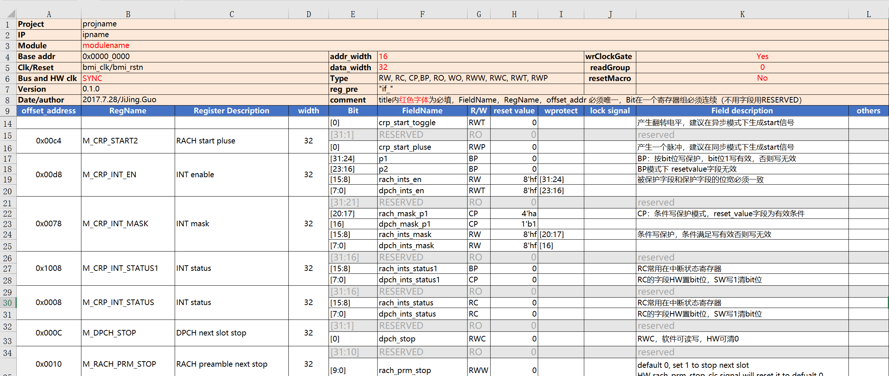

  
  
  
  
  <h1>regif</h1>

## What is this

automatic register inteface RTL generator with better excel template

## Why

**Compared with other similar tools:**

1. with pretty excel template with good readability 
2. with safety validation check, never generate broken verilog 
3. with pretty and clear verilog code style
4. develop with python, cross platform[windows, linux, macos]
5. full feature(clock-gate/read-group/reset-macro/mem/fifo/)
6. open source, docx, json, cHead will be supported

## Usage

### install

`pip install regif`

you can also directly use `python [regif.py](http://regif.py) mymodule.xls`

### usage

**step1**: `regif --init mymodule` will generate  `mymodule.xls` template at current dir, 

**step2**: then you need specify your owner register in `mymodule.xls`

**step3**: `regif mymodule.xls` generate `my_ip.v[my_ip_wrap.v], my_ip.docx` at current dir 

## Accesstype

**RO**

**WO**

**RW**

**RC**

**WC**

**CP**

**BP**

**RWT**

**RWP**

**W1S**

**W1C**

## Scenario

1. interruption
2. configure lockable 
3. trigger or start 
4. read-group 
5. fifo
6. mem
7. clockgate 
8. reset macro 

## FAQ

1. xx
2. xx
